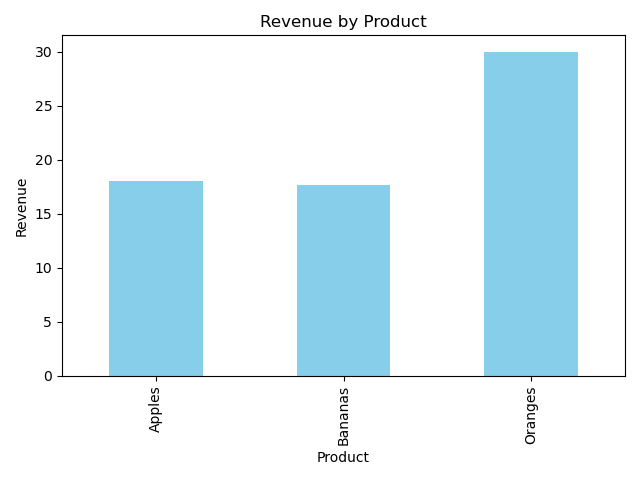

# 📊  Basic Sales Summary from a Tiny SQLite Database using Python

This repository contains a simple Python script that demonstrates how to:

- Create a SQLite database (`sales_data.db`)
- Populate it with sample sales data
- Query the database using SQL
- Display the results using `print` and a basic `matplotlib` bar chart

## 📁 Project Structure

```
.
├── sales_data.db        
├── sales_chart.png       
├── sales_data_script.ipynb  
└── README.md             
```

## 🛠️ Requirements

- Python 3.x
- Libraries:
  - `sqlite3` (built-in)
  - `pandas`
  - `matplotlib`

### Install dependencies

```bash
pip install pandas matplotlib
```

## 🚀 How to Run

```bash
python sales_data_script.ipynb
```

This will:
- Create a SQLite database with a `sales` table
- Insert sample records
- Print a summary of total quantity and revenue by product
- Display a bar chart of revenue per product
- Save the chart as `sales_chart.png`

## 📈 Sample Output

**Console Output:**
```
Sales Summary:
   product  total_qty  revenue
0  Apples         15     18.0
1  Bananas        22     17.6
2  Oranges        20     30.0
```

**Chart Output:**



## 📚 Learnings

- SQLite database handling with Python
- Basic SQL for aggregation
- Data visualization using `matplotlib` and `pandas`
